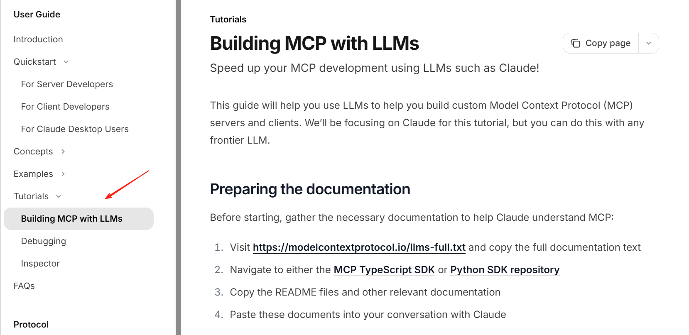

构建一个 MCP Server 听起来可能有些复杂，需要对协议规范有深入的理解。在 AI 辅助编程已成为新常态的今天，我们可以借助 AI 的力量，大大简化这一过程。

### MCP Server 核心概念

在深入实践之前，我们先简单了解一下 MCP 的核心架构。MCP 遵循客户端-服务器模型：

*   **MCP Client**：通常内嵌在宿主应用（如 IDE、代码编辑器、聊天工具）中，负责与用户和 LLM 交互。Client一般不需要我们去开发。
*   **MCP Server**：一个独立的进程，负责向客户端提供特定的能力，如工具（Tools）、上下文资源（Resources）等。

### 基于 AI 辅助编写 MCP Server
在官方文档（https://modelcontextprotocol.io/quickstart/server） MCP Server 的开发方式，以及官方提供的各个语言的 SDK 的示例代码。
写的挺清晰的，如果你懂代码，仔细看一遍很快就能上手，但在 AI 时代，从零自己去写肯定不可能了，官方其实也建议通过 AI 来帮我们实现 MCP，所以在文档中单独还提供了一个 Building MCP with LLMs 的章节。



#### 第一步：理解规范 (Understanding the Spec)

大概思路如下：

在开始之前，收集必要的文档，以帮助 AI 了解 MCP：

访问 https://modelcontextprotocol.io/llms-full.txt 并复制完整的文档文本。
导航到 MCP 的 TypeScript 软件开发工具包（SDK）或 Python 软件开发工具包的代码仓库。
复制（README）和其他相关文档。
将这些文档粘贴到你与克劳德的对话中。
提供了相关文档之后，向 AI 清晰地描述你想要构建的服务器类型：

你的服务器将公开哪些资源。
它将提供哪些工具。
它应该给出的任何提示。
它需要与哪些外部系统进行交互。
比如这是一个例子：构建一个 MCP 服务器，该服务器：

连接到我公司的 PostgreSQL 数据库。
将表模式作为资源公开。
提供用于运行只读 SQL 查询的工具。
包含针对常见数据分析任务的提示。
在实际测试中我发现，上面提到的 https://modelcontextprotocol.io/llms-full.txt 这个文档就是整个文档站的内容，里面包含了很多构建 MCP Server 不需要的内容，反而会给模型造成干扰，大家可以直接参考下面的提示词：
```java
## 需求

基于提供的 MCP 相关资料，帮我构建一个 MCP Server，需求如下：

- 提供一个获取当前时间的工具
- 接收时区作为参数（可选）
- 编写清晰的注释和说明
- 要求功能简洁、只包含关键功能
- 使用 TypeScript 编写

请参考下面四个资料：

## [参考资料 1] MCP 基础介绍

- 粘贴 https://modelcontextprotocol.io/introduction 里的内容。

## [参考资料 2] MCP 核心架构

- 粘贴 https://modelcontextprotocol.io/docs/concepts/architecture 里的内容。

## [参考资料 3] MCP Server 开发指引

- 粘贴 https://modelcontextprotocol.io/quickstart/server 里的内容。

## [参考资料 4] MCP Typescript SDK 文档

- 粘贴 https://github.com/modelcontextprotocol/typescript-sdk/blob/main/README.md 里的内容。
```

#### 第二步：搭建项目骨架 (Scaffolding)

下面是一个 AI 帮我生成好的 MCP Server 的关键代码：

```javascript
import { McpServer } from "@modelcontextprotocol/sdk/server/mcp.js";
import { StdioServerTransport } from "@modelcontextprotocol/sdk/server/stdio.js";
import { z } from "zod";

const server = new McpServer({
  name: "TimeServer", // 服务器名称
  version: "1.0.0", // 服务器版本
});


server.tool(
  "getCurrentTime", // 工具名称,
  "根据时区（可选）获取当前时间", // 工具描述
  {
    timezone: z
      .string()
      .optional()
      .describe(
        "时区，例如 'Asia/Shanghai', 'America/New_York' 等（如不提供，则使用系统默认时区）"
      ),
  },
  async ({ timezone }) => {
     // 具体工具实现，这里省略
  }
);

/**
 * 启动服务器，连接到标准输入/输出传输
 */
async function startServer() {
  try {
    console.log("正在启动 MCP 时间服务器...");
    // 创建标准输入/输出传输
    const transport = new StdioServerTransport();
    // 连接服务器到传输
    await server.connect(transport);
    console.log("MCP 时间服务器已启动，等待请求...");
  } catch (error) {
    console.error("启动服务器时出错:", error);
    process.exit(1);
  }
}

startServer();

```
其实代码非常简单，我们可以拆分为三部分来理解：

第一步：使用官方提供的 @modelcontextprotocol/sdk/server/mcp.js 包，创建一个 McpServer 实例。
第二步：使用 server.tool 定义提供的工具方法，包括工具方法的名称、工具方法的描述、工具方法的参数、工具方法的具体实现逻辑。

另外使用了 "zod" 这个包定义了方法参数的类型以及描述。
第三步：启动 Server，并且使用 SDK 中导出的 StdioServerTransport 来定义工具使用 STDIO 通信协议，等待外部的标准输入，并且把工具的执行结果转化为标准输出反馈到外部。

就是这么简单，我们只需要按照这个模板来添加更多的工具实现就可以了，另外 Resources、Prompt 的编写方式其实都是类似的，大家只需要按照这套提示词模板，定义好自己的需求，AI（Claude 的准确性最高）基本上都能比较完整的实现。


#### 使用 inspector 调试 MCP Server
开发完成后，我们可以直接使用官方提供的 MCP Server 调试工具（@modelcontextprotocol/inspector）来进行调试。
比如我们可以调试我们刚刚开发好的工具，这里直接使用 node 运行我们本地构建好的代码：
```bash
npx @modelcontextprotocol/inspector node dist/index.js
```
启动成功后，它会在我们的本地监听 6274 端口，我们点击 Connect
连接成功后，我们点击 List Tools
然后可以看到当前 MCP Server 定义的所有工具，我们这里定义了一个获取当前时间的工具，我们点击这个工具，可以对它进行调试。